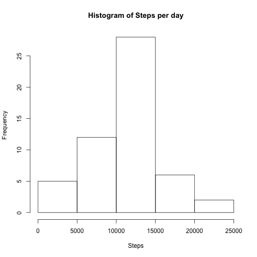
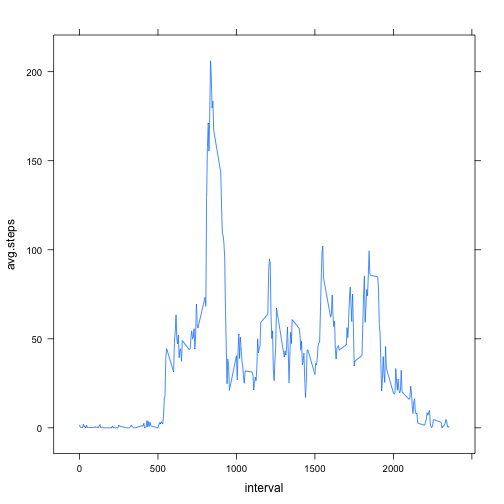
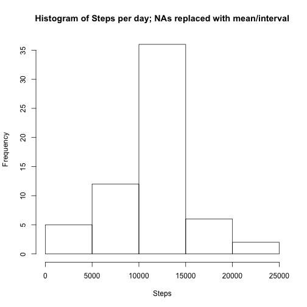
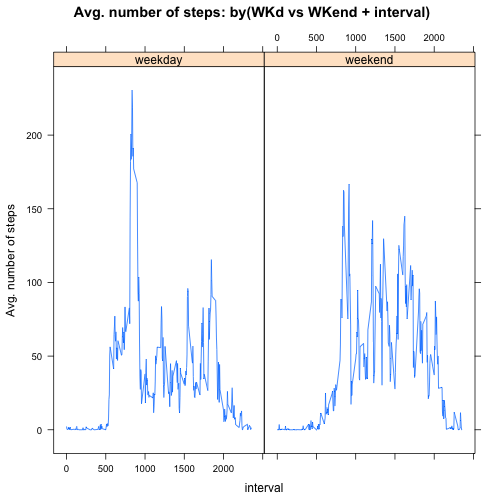

Reproducible Research: Peer Assessment 1
========================================================

## Setting working directory and packages

```r
setwd("~/Documents/projects/data_science_specialization/reproducible_research/")
library(data.table)
```

## Loading and preprocessing the data
### Read the file

```r
        data<-read.csv("activity.csv")
```
### Ignore NA records under steps columns

```r
        step.per.day<-data[!is.na(data$steps),]
        step.per.day<-as.data.table(step.per.day)
```

## What is the mean total number of steps taken per day?
### Total number of steps per day

```r
        total.step.per.day<-step.per.day[,sum(steps),by=date]
```
### Histogram of total steps per day

```r
        hist(total.step.per.day$V1,xlab="Steps",main="Histogram of Steps per day")
```

 
### Mean and median of total number of steps taken per day

```r
        summary(total.step.per.day$V1)[c(3,4)]        
```

```
## Median   Mean 
##  10760  10770
```

## What is the average daily activity pattern?
### Average number of steps taken, averaged across all days (y) vs interval(x)

```r
        average.steps<-step.per.day[,list(avg.steps=ave(steps)),by=interval]
        library(lattice)
        xyplot(avg.steps~interval,data=average.steps,type="l")
```

 
### Which 5 minute interval, on average across all the days in the dataset, contains maximum number of steps?

```r
        unique(average.steps[avg.steps==max(avg.steps)])
```

```
##    interval avg.steps
## 1:      835  206.1698
```

## Imputing missing values
### Total number of rows with NAs

```r
        data<-as.data.table(data)
        dim(data[is.na(steps)])[1]
```

```
## [1] 2304
```
### Strategy to fill in missing data; mean/median for that day or mean for that 5-minute interval

```r
        no.mis.data<-merge(data,unique(average.steps),by="interval",all.x=T)
        no.mis.data$complete.steps<-ifelse(is.na(no.mis.data$steps),no.mis.data$avg.steps,no.mis.data$steps)
        setnames(no.mis.data,c("steps","complete.steps"),c("old.steps","steps"))        
```
       
## From the no "NA" data, plot histogram and compare if mean, median of total number of steps taken per day is different than what was observed before, when "NA" containing data was removed
### Total number of steps per day

```r
        total.step.per.day.no.mis.data<-no.mis.data[,sum(steps),by=date]
```
### Histogram of total steps per day

```r
        hist(total.step.per.day.no.mis.data$V1,xlab="Steps",main="Histogram of Steps per day; NAs replaced with mean/interval")
```

 
### Mean and median of total number of steps taken per day

```r
        summary(total.step.per.day.no.mis.data$V1)[c(3,4)]
```

```
## Median   Mean 
##  10770  10770
```
### If mean median (without NA and NA replaced by mean steps by interval) differ 

```r
        mm.no.na.total.step.per.day<-summary(total.step.per.day$V1)[c(3,4)]
        mm.na.total.step.per.day<-summary(total.step.per.day.no.mis.data$V1)[c(3,4)]
        ifelse(mm.no.na.total.step.per.day[1]==mm.na.total.step.per.day[1],
               "No change in Median total number of steps taken per day: [NA steps and associated records removed] IS EQUAL to [NAs replaced by mean steps by interval]",
               "Change in Median total number of steps taken per day: [NA steps and associated records removed] IS NOT EQUAL to [NAs replaced by mean steps by interval]")
```

```
##                                                                                                                                                     Median 
## "Change in Median total number of steps taken per day: [NA steps and associated records removed] IS NOT EQUAL to [NAs replaced by mean steps by interval]"
```

```r
        ifelse(mm.no.na.total.step.per.day[2]==mm.na.total.step.per.day[2],
               "No change in Mean total number of steps taken per day: [NA steps and associated records removed] IS EQUAL to [NAs replaced by mean steps by interval]",
               "Change in Mean total number of steps taken per day: [NA steps and associated records removed] IS NOT EQUAL to [NAs replaced by mean steps by interval]")
```

```
##                                                                                                                                                    Mean 
## "No change in Mean total number of steps taken per day: [NA steps and associated records removed] IS EQUAL to [NAs replaced by mean steps by interval]"
```

## Are there differences in activity patterns between weekdays and weekends?

```r
average.steps.no.na<-no.mis.data[,"daytype":=weekdays(as.Date(date))]
average.steps.no.na[,"WKvsWEN":=ifelse(grepl("^[S]",daytype),"weekend","weekday")]
```

```
##        interval old.steps       date avg.steps     steps   daytype WKvsWEN
##     1:        0        NA 2012-10-01  1.716981  1.716981    Monday weekday
##     2:        0         0 2012-10-02  1.716981  0.000000   Tuesday weekday
##     3:        0         0 2012-10-03  1.716981  0.000000 Wednesday weekday
##     4:        0        47 2012-10-04  1.716981 47.000000  Thursday weekday
##     5:        0         0 2012-10-05  1.716981  0.000000    Friday weekday
##    ---                                                                    
## 17564:     2355         0 2012-11-26  1.075472  0.000000    Monday weekday
## 17565:     2355         0 2012-11-27  1.075472  0.000000   Tuesday weekday
## 17566:     2355         0 2012-11-28  1.075472  0.000000 Wednesday weekday
## 17567:     2355         0 2012-11-29  1.075472  0.000000  Thursday weekday
## 17568:     2355        NA 2012-11-30  1.075472  1.075472    Friday weekday
```

```r
average.steps.no.na[,"avg.WKvsWEN.interval":=ave(steps),by=c("WKvsWEN","interval")]
```

```
##        interval old.steps       date avg.steps     steps   daytype WKvsWEN
##     1:        0        NA 2012-10-01  1.716981  1.716981    Monday weekday
##     2:        0         0 2012-10-02  1.716981  0.000000   Tuesday weekday
##     3:        0         0 2012-10-03  1.716981  0.000000 Wednesday weekday
##     4:        0        47 2012-10-04  1.716981 47.000000  Thursday weekday
##     5:        0         0 2012-10-05  1.716981  0.000000    Friday weekday
##    ---                                                                    
## 17564:     2355         0 2012-11-26  1.075472  0.000000    Monday weekday
## 17565:     2355         0 2012-11-27  1.075472  0.000000   Tuesday weekday
## 17566:     2355         0 2012-11-28  1.075472  0.000000 Wednesday weekday
## 17567:     2355         0 2012-11-29  1.075472  0.000000  Thursday weekday
## 17568:     2355        NA 2012-11-30  1.075472  1.075472    Friday weekday
##        avg.WKvsWEN.interval
##     1:             2.251153
##     2:             2.251153
##     3:             2.251153
##     4:             2.251153
##     5:             2.251153
##    ---                     
## 17564:             1.410063
## 17565:             1.410063
## 17566:             1.410063
## 17567:             1.410063
## 17568:             1.410063
```

```r
xyplot(avg.WKvsWEN.interval~interval|WKvsWEN,data=average.steps.no.na,type="l",main="Avg. number of steps: by(WKd vs WKend + interval)",ylab="Avg. number of steps")
```

 
## Thank you for your time reviewing my code
